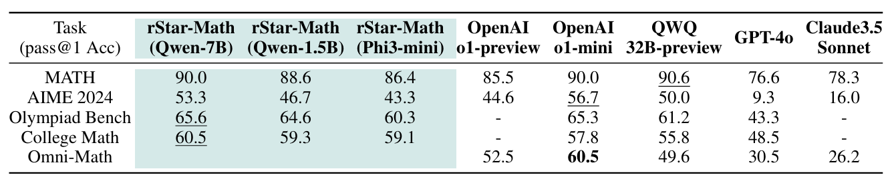

<h1 align="center">
<br>
rStar-Math
</h1>

<p align="center">
📃 <a href="https://huggingface.co/papers/2501.04519" target="_blank">[Paper]</a> 
</p>

Repo for "[rStar-Math: Small LLMs Can Master Math Reasoning
with Self-Evolved Deep Thinking](https://huggingface.co/papers/2501.04519)".

Authors: [Xinyu Guan](https://gxy-2001.github.io/)\*, [Li Lyna Zhang](https://www.microsoft.com/en-us/research/people/lzhani/)\*, Yifei Liu, Ning Shang, Youran Sun, Yi Zhu, Fan Yang, Mao Yang

<p align="center">
    
        <br>
    <em>Table 1: rStar-Math enables frontier math reasoning in SLMs via deep thinking over 64 trajectories.</em>
</p>

## News 
- **[01/15/2025]** Our code has been open-sourced.
- **[01/09/2025]** Our paper is released: https://huggingface.co/papers/2501.04519.


## Contents
- [Introduction](#Introduction)
- [Setup](#Setup)
- [Usage](#Usage)
- [Citation](#Citation)
- [Acknowledgement](#Acknowledgement)


## Introduction
We present rStar-Math to demonstrate that small language models (SLMs) can rival or even surpass the math reasoning capability of OpenAI o1-mini, without distillation from superior models. rStar-Math achieves this by exercising "deep thinking" through Monte Carlo Tree Search (MCTS), where a math policy SLM performs test-time search guided by an SLM-based process reward model. The diagram below presents an overview of the rStar-Math framework, highlighting its core components and processes.

<p align="center">
  
</p>

## Setup

We recommend using conda for environment management and executing the code on an A100 80G GPU equipped with CUDA 12.4.
1. Create a Python environment with python3.11: 
```
conda create -y --name rstar python=3.11
conda init && source deactivate # init
conda activate rstar
```
2. Install requirements
```
pip install --upgrade pip
pip install -r requirements.txt

# optional: install flash-attn 2
# pip install flash-attn --no-build-isolation
```
3. Install [evaluation toolkit](https://arxiv.org/abs/2404.13925)
```
git clone https://github.com/MARIO-Math-Reasoning/MARIO_EVAL.git
cd MARIO_EVAL
cd latex2sympy && pip install . && cd ..
pip install -e .
cd ..
```

vllm 0.6.6 requires torch 2.5.1, which requires CUDA 12.4. If your CUDA version is lower than 12.4, you can execute the following command:
```
export LD_LIBRARY_PATH=$(python -c "import site; print(site.getsitepackages()[0] + '/nvidia/nvjitlink/lib')"):$LD_LIBRARY_PATH
```
This will help prevent the error: undefined symbol: __nvJitLinkComplete_12_4, version libnvJitLink.so.12.

## Usage

### Generate Training Data 

#### From Teacher Model

You may choose to use the following command to generate train data. Please ensure that sufficient GPU memory is allocated for the model, and modify the `CUDA_VISIBLE_DEVICES` as well as the `llm_gpu_memory_utilization` and `tp` parameters in the configuration file. This corresponds to round 1 in the paper.

```bash
MODEL="deepseek-ai/DeepSeek-Coder-V2-Instruct"  
QAF="train set path"
CFG="config/sample_mcts.yaml"
CUDA_VISIBLE_DEVICES="0,1,2,3,4,5,6,7" python main.py --qaf $QAF --custom_cfg $CFG --model_dir $MODEL
```

#### From rStar Policy Model and Reward Model

If you have already trained the SFT model and the reward model, you can use the following command to generate higher-quality training data. This corresponds to rounds 2-4 in the paper.

```bash
MODEL="policy model dir"  
RM="reward model dir" 
QAF="train set path"
CFG="config/sft_sample_mcts.yaml"
CUDA_VISIBLE_DEVICES="0" python main.py --qaf $QAF --custom_cfg $CFG --model_dir $MODEL --reward_model_dir $RM
```

### Inference & Evaluation

#### MCTS Inference with Policy Model and Reward Model

Running the following command will allow you to reproduce the results presented in our main table. For each run, we select the trajectory based on the highest score of the entire response. There is an example of a run in `run_example.sh.`

```bash
MODEL="policy model dir"
RM="reward model dir" 
QAF="test set path"
CFG="config/sft_eval_mcts.yaml"
CUDA_VISIBLE_DEVICES="0" python main.py --qaf $QAF --custom_cfg $CFG --model_dir $MODEL --reward_model_dir $RM
```

Running the above command will consume a significant amount of GPU time. A practical strategy is to slightly reduce the values of the `n_generate_sample` and `iterations` parameters, for example, lowering them to 16 and 8 respectively, which can still yield satisfactory results. Another approach is to replace MCTS with step beam search. We have tested this method and found it to be more efficient in terms of search speed, although it may slightly compromise accuracy compared to MCTS. Please try using the following command to implement this strategy.

```bash
MODEL="policy model dir"
RM="reward model dir" 
QAF="test set path"
CFG="config/sft_eval_bs.yaml"
CUDA_VISIBLE_DEVICES="0" python main.py --qaf $QAF --custom_cfg $CFG --model_dir $MODEL --reward_model_dir $RM
```


#### Greedy Decode with Policy Model

Running the following command will generate the results using Greedy Decode.

```bash
MODEL="policy model dir"
QAF="test set path"
CFG="config/sft_eval_greedy.yaml"
CUDA_VISIBLE_DEVICES="0" python main.py --qaf $QAF --custom_cfg $CFG --model_dir $MODEL
```

We have encapsulated the evaluation process, allowing for the convenient generation of greedy decode results by simply specifying the following tasks: `gsm8k`, `math`, `math500`, `aime2024`, `amc23`, `collegemath`, `gaokao2023en`, `olympiadbench`, and `omni-math`. By default, the result files will be stored in the same directory as the model.

```bash
# same effect
MODEL="policy model dir"
python eval.py --model "$MODEL" --device 0 --task amc23 
# eval inference result
python eval_output.py --file_path $MODEL"/amc23.jsonl"
```


### Fine-tune the Policy Model and Reward Model

The training script below documents the parameters I used for training the model. These parameters are configured by default for 8*mi300x GPUs. Considering that most users are likely working with NVIDIA GPUs that have smaller VRAM capacities, please reduce the per_device_train_batch_size and correspondingly increase the gradient_accumulation_steps when running the script.

Additionally, you can utilize flash_attention_2 by adding the flag --attn_impl flash_attention_2. I have compared the results of using `flash_attention_2` with the `eager` implementation, and the models trained with both methods exhibit similar levels of accuracy.

The files `train/sft_data_examples.json` and `train/rm_data_examples.json` contain examples of the training data. We plan to open-source the complete training dataset in the near future, so stay tuned for updates!

**SFT Train Script**
```bash

export NCCL_IB_DISABLE=1
export NCCL_P2P_DISABLE=0
export NLLC_P2P_LEVEL=NVL
export CUBLAS_WORKSPACE_CONFIG=:4096:8
export NCCL_BLOCKING_WAIT=0
export FLASH_ATTENTION_DETERMINISTIC=1
export MASTER_ADDR="localhost"
export MASTER_PORT="1939"
export GLOO_SOCKET_IFNAME="lo"
export NCCL_SOCKET_IFNAME="lo"


CUDA_VISIBLE_DEVICES=0,1,2,3,4,5,6,7 python3 -m torch.distributed.launch --master_addr ${MASTER_ADDR} --master_port ${MASTER_PORT} --nproc_per_node=8 --use_env train/train_SFT.py \
    --model_name_or_path "Qwen/Qwen2.5-Math-7B" \
    --data_path "data_path" \
    --data_length 10000000 \
    --bf16 True \
    --output_dir "path_to_save" \
    --num_train_epochs 2 \
    --per_device_train_batch_size 4 \
    --per_device_eval_batch_size 4 \
    --gradient_accumulation_steps 4 \
    --evaluation_strategy "no" \
    --save_strategy "steps" \
    --save_steps 100000 \
    --save_total_limit 2 \
    --learning_rate 7e-6 \
    --weight_decay 0.1 \
    --warmup_ratio 0 \
    --lr_scheduler_type "linear" \
    --logging_steps 1 \
    --fsdp "full_shard auto_wrap" \
    --fsdp_transformer_layer_cls_to_wrap 'Qwen2DecoderLayer'
    # --attn_impl flash_attention_2 # 
```

**RM Train Script**
```bash

export WANDB_DISABLED=true
export CUBLAS_WORKSPACE_CONFIG=:4096:8
export FLASH_ATTENTION_DETERMINISTIC=1

accelerate launch --num_processes=8 train/train_RM.py \
    --model_name_or_path="sft_model_path" \
    --output_dir="path_to_save" \
    --pair_json_path "data_path" \
    --per_device_train_batch_size=16 \
    --per_device_eval_batch_size=16 \
    --num_train_epochs=2 \
    --gradient_accumulation_steps=4 \
    --gradient_checkpointing=True \
    --learning_rate=7e-6 \
    --remove_unused_columns=False \
    --optim="adamw_torch" \
    --logging_steps=1 \
    --eval_strategy="steps" \
    --eval_steps=750 \
    --save_steps=750 \
    --load_best_model_at_end \
    --save_total_limit=5 \
    --max_length=2048 \
    --bf16 \
    --fsdp "full_shard auto_wrap" \
    --fsdp_transformer_layer_cls_to_wrap 'Qwen2DecoderLayer' 
    # --attn_impl flash_attention_2 

```


---


## Citation
If you find this repo useful for your research, please consider citing the paper
```
@misc{guan2025rstar,
    title={rStar-Math: Small LLMs Can Master Math Reasoning with Self-Evolved Deep Thinking},
    author={Xinyu Guan and Li Lyna Zhang and Yifei Liu and Ning Shang and Youran Sun and Yi Zhu and Fan Yang and Mao Yang},
    year={2025},
    eprint={2501.04519},
    archivePrefix={arXiv},
    primaryClass={cs.CL}
}
```